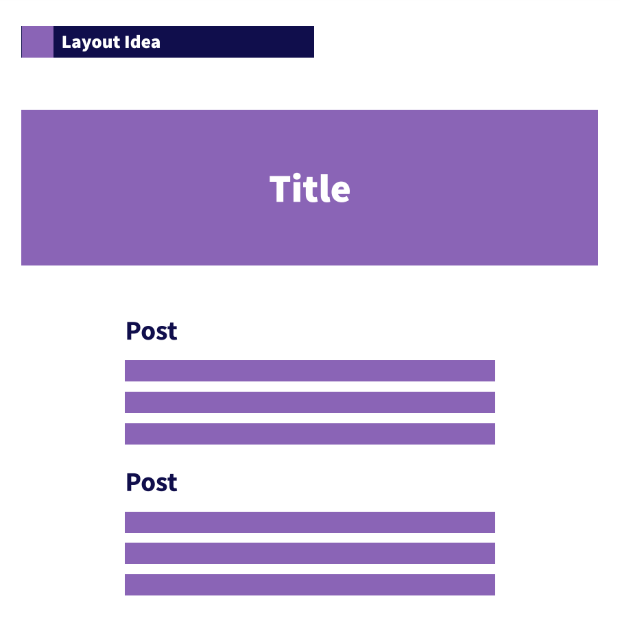

# react-exercise 1

Create a social media page which contains posts. Each post card consist of a title and a text. Then add a comment section where a user can add a comment, delete it, or update it.

