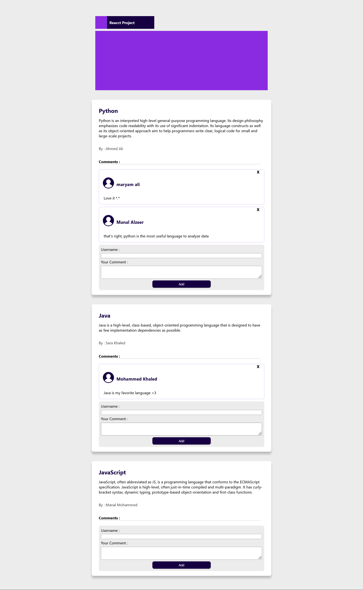

# react posting project

I created a social media page with posts on it.
Each post card has a headline and a paragraph.
the webpage provides the ability to add and remove comments from the comment form

- This project was bootstrapped with [Create React App](https://github.com/facebook/create-react-app).
 - This project does not support Mobile & Tablets

## get Start

In the project directory, you can run:

- `npm install`
- `npm start`

## Project Screenshot

